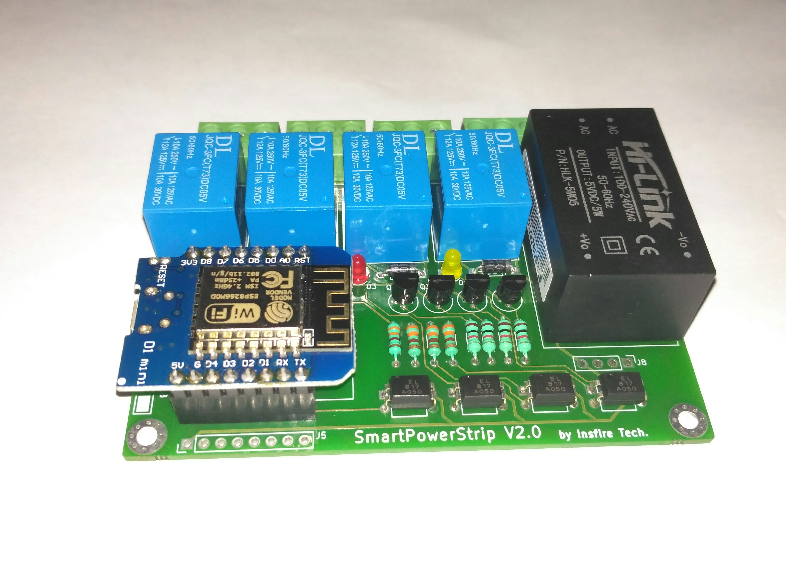
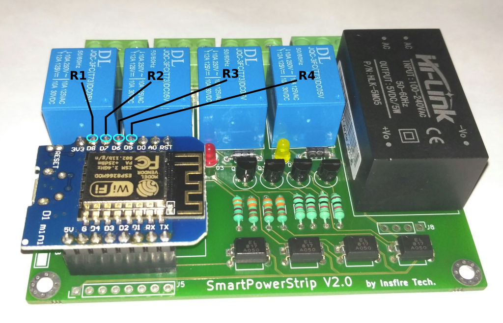

# Smart Power Strip v2.0
Control board is equipped with most familiar ESP8266 based Wemos d1 microcontroller and 4 Relay to operate 4 Electrical devices. 

## Features:
- Arduino compatible
- IoT ready, connect to any cloud
- Onboard 230AC to 5V DC converter
- Optoisolated from HIGH AC voltage
- Onboard Relay LED indicator
- COM, NO, and NC all relay pins breakout to facilitate two-way wiring
- Board size 92mmx68mm

Let us check out the details of pin connection going from Wemos D1 to the various part on the baseboard and other breakouts which are available.
### With Relay:

### Other Breakouts:

## Sample Projects :- 
https://www.hackster.io/skyline/smart-power-strip-v2-0-616c3c

[Visit Store!](https://www.instamojo.com/insfiretechnologies/smart-power-strip-controller-board/) to Get one for you.

